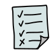
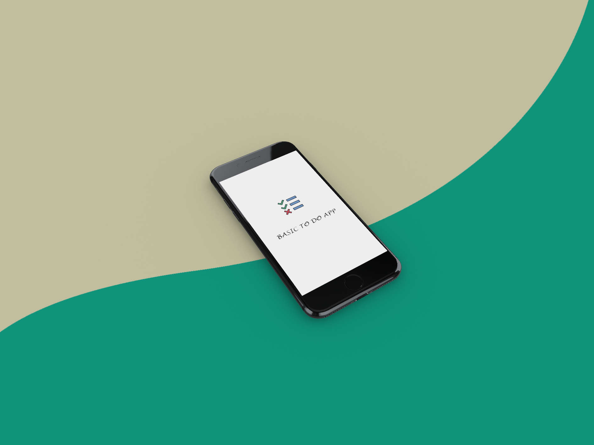
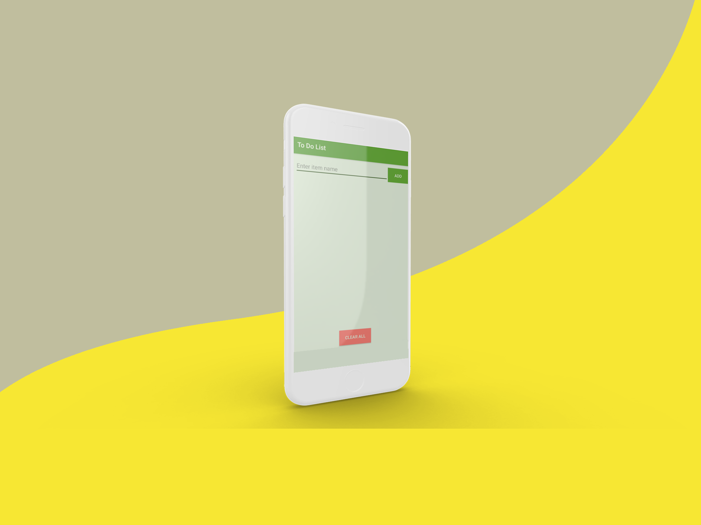
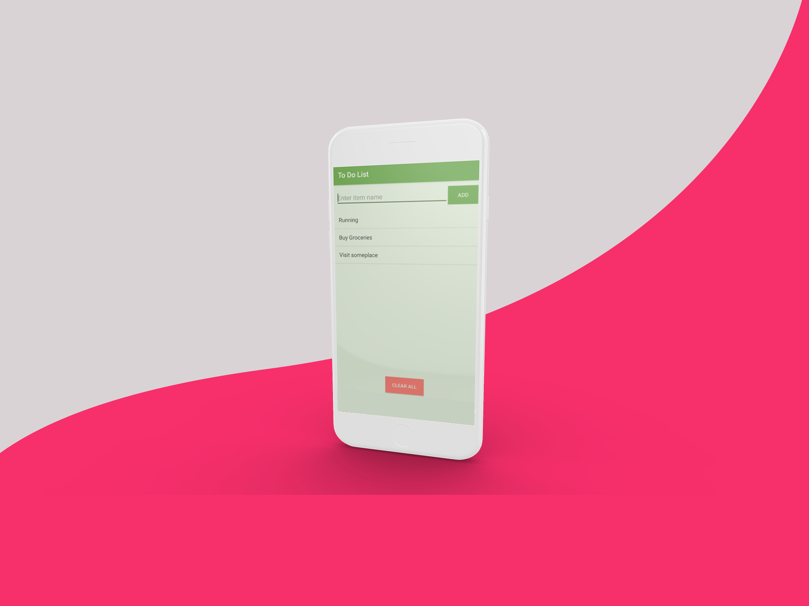

# To Do App

A Basic To do app for Android v 5.0 and above.

### Installing

Clone the repo and use Android Studio.

## Screenshots

These android mockups were taken from [Threed](https://threed.io/)

## Downloads
* [Releases](https://github.com/PulkitBanta/ToDoList-Android/releases)

## Use
* Create tasks that you want to complete.
* To delete a task simply click on it.
* To delete all the tasks click CLEAR ALL button.
* All tasks are stored in local file.
* No task will be lost on closing of the application.

## Built With

* [Android Studio](https://developer.android.com/) - Android Studio provides the fastest tools for building apps on every type of Android device.
* [Java](https://www.java.com/en/)

## Coming soon

* Timer
* Notification
* Performance optimizations

## Contributing

Please read [CONTRIBUTING.md](CONTRIBUTING.md) for details on our code of conduct, and the process for submitting pull requests to us.

## Authors

* **Pulkit Banta** - *Initial work* - [PulkitBanta](https://github.com/PulkitBanta)

## License

This project is licensed under the MIT License - see the [LICENSE.md](LICENSE.md) file for details